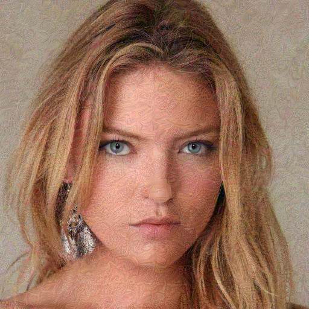

# TIP-RSR

TIP-RSR restores images with a two-branch pipeline based on GFPGAN and
Real-ESRGAN, then combines the results with a BiSeNet face parsing mask.

## Installation

Create the Conda environment:

```bash
conda env create -f environment.yml
conda activate TIP_RSR
```

## Model weights

The BiSeNet face parsing checkpoint is included in this repository at:

```text
BiSeNet/79999_iter.pth
```

GFPGAN and Real-ESRGAN weights are not included because of their large file
sizes. Their inference scripts automatically download the official weights when
local files are unavailable, so no manual setup is required for these two
models.

See the upstream projects for model details:

- [GFPGAN](https://github.com/TencentARC/GFPGAN)
- [Real-ESRGAN](https://github.com/xinntao/Real-ESRGAN)
- [face-parsing.PyTorch](https://github.com/zllrunning/face-parsing.PyTorch)

## Usage

Put source images in a folder and run:

```bash
python main.py --ori_imgs input/ --save_folder output/
```

Supported input extensions are PNG. Final restored images are
written to `output/cut_imgs/`, with parsing maps under
`output/cut_imgs/parsing_maps/`.

Optional arguments:

```text
--jpeg_quality 75
--re_size 512
--alpha 0.8
```

Use a fresh output directory for each run to avoid mixing results from earlier
runs.

## Results

The following examples compare degraded input images with the final restored
images produced by TIP-RSR.

| Input | Restored result |
| :---: | :---: |
|  |  |
|  |  |
|  |  |
